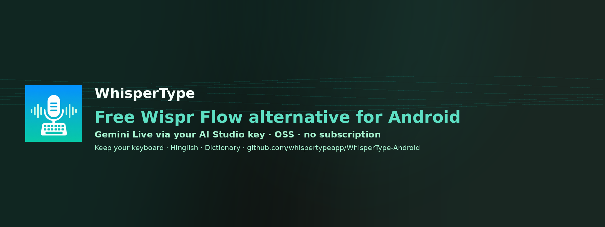
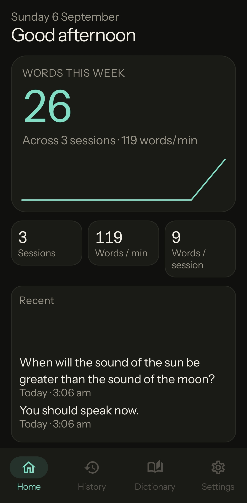
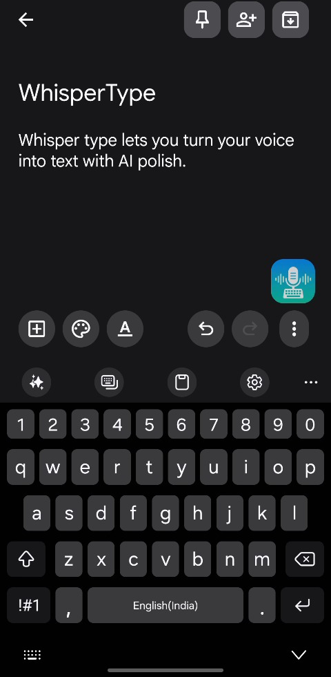
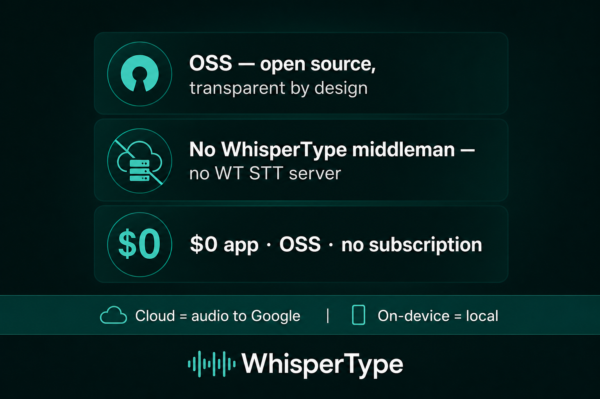
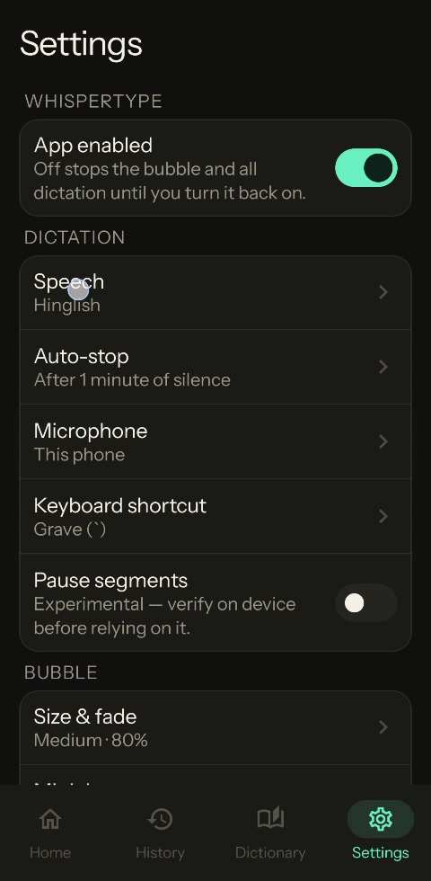
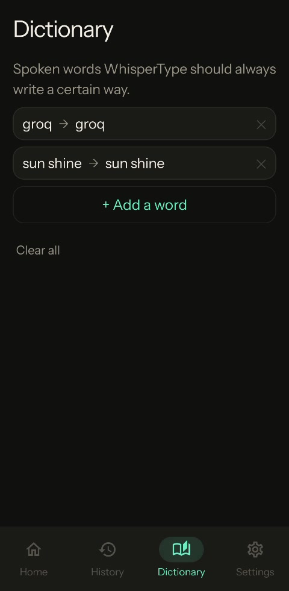
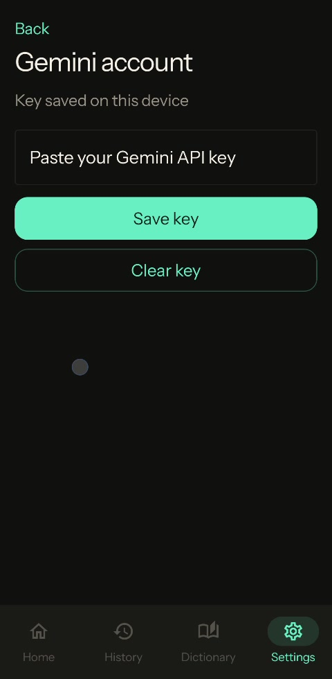
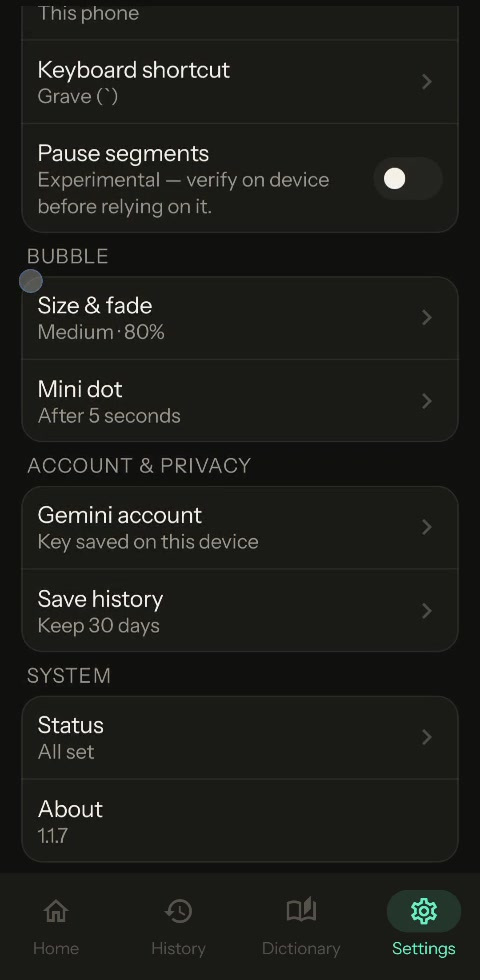
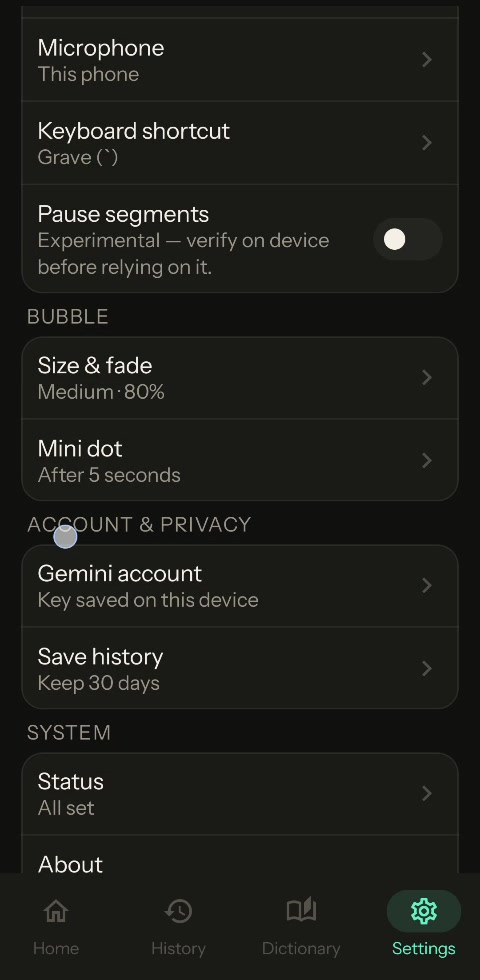

<p align="center">
  
</p>

# WhisperType

**Free Wispr Flow alternative for Android** — keep your keyboard, dictate with **Gemini Live** via your own [Google AI Studio](https://aistudio.google.com/) key. Open source. **$0**. No WhisperType subscription or servers.

> **Tradeoff (honest):** when you dictate, audio goes to Google under *your* AI Studio key. WhisperType does not run a middleman backend.

[-3DDC84?logo=android&logoColor=white)](#requirements)
[](LICENSE)
[](https://github.com/whispertypeapp/WhisperType-Android/releases/tag/v1.0.0)
[](https://github.com/whispertypeapp/WhisperType-Android)

---

## What it is

WhisperType is an open-source **Android voice-to-text** app that **keeps your normal keyboard**. A floating mic / bubble overlays your screen and inserts transcription **at the cursor** in Messages, Gmail, Notes, WhatsApp, and other focused fields — you do **not** swap to a voice IME.

- **BYO Gemini key only** — Gemini Live (`gemini-3.5-transcribe-live`); **no** on-device / dual-mode path  
- **No WhisperType cloud account** — key saved on device  
- **Hinglish**, custom **Dictionary** (spoken → written), **History**, overlay bubble + **Grave (`` ` ``)** shortcut  

<p align="center">
  
  
  
</p>

## Quick start

1. Install `WhisperType-Android-1.0.0.apk` from [Releases v1.0.0](https://github.com/whispertypeapp/WhisperType-Android/releases/tag/v1.0.0).  
2. Grant mic, overlay, accessibility, and notifications as prompted.  
3. **Settings** → paste your **Gemini API key** from [AI Studio](https://aistudio.google.com/).  
4. Focus any text field → tap the bubble (or Grave `` ` ``) → speak.

## Gemini BYOK

WhisperType does **not** sell API access or proxy transcription through WhisperType servers.

### Honest limits

- AI Studio **Free** tier is $0 but **rate-limited** (RPM / TPM / RPD) — not unlimited  
- Long sessions may hit Google continuous-session caps (~10 minutes class)  
- Free-tier data handling follows **Google’s** terms — check current AI Studio policy  
- Higher quotas → enable billing on the **Google** side  

Privacy footnote: **No WhisperType servers.** We do **not** claim to be more private than other cloud STT.

## Gallery

<p align="center">
  
  
  
  
  
</p>

Curated set only — see `docs/screenshots/gallery/`. Full UI dumps live under `docs/screenshots/ui-v2/` etc. for maintainers, not the landing page.


## vs Wispr Flow / Typeless

| | WhisperType | Wispr Flow | Typeless |
|--|-------------|------------|----------|
| Keyboard | **Keep yours** + floating mic | Their flow | Voice IME / replaces keyboard |
| Cost | App **$0**; Google bill only if you leave free tier | SaaS | Their pricing |
| Backend | **No WhisperType servers** | Their cloud | Their stack |
| Source | **OSS** | Closed | Closed |

## Features (v1.0.0)

- Home · History · Dictionary · Settings (dark UI v2)  
- Speech: English / **Hinglish** · Auto-stop 1 min · Grave shortcut · Bubble controls  
- Gemini key on device · History 30 days (UI default) · Status checklist  

## Requirements

- **Android 13+** (API **33**)  
- Package: `com.whispertype.android`  
- Network + mic + overlay + accessibility  
- Google AI Studio API key  

## Install

Download `WhisperType.apk` from [Releases](https://github.com/whispertypeapp/WhisperType-Android/releases).

```text
SHA256:
f7a55069bddcc6a24baad469d5df5b0a76a757bdfa34af375dcbe73b3f9f99df  WhisperType.apk
```

```bash
git clone https://github.com/whispertypeapp/WhisperType-Android.git
cd WhisperType-Android
```


## Contributing

See [CONTRIBUTING.md](CONTRIBUTING.md). **Never paste API keys** into issues.

## License

Apache License 2.0 — see [LICENSE](LICENSE).

## Disclaimer

Gemini / AI Studio are Google products. WhisperType is independent OSS. Quotas, pricing, and data terms are Google’s.
